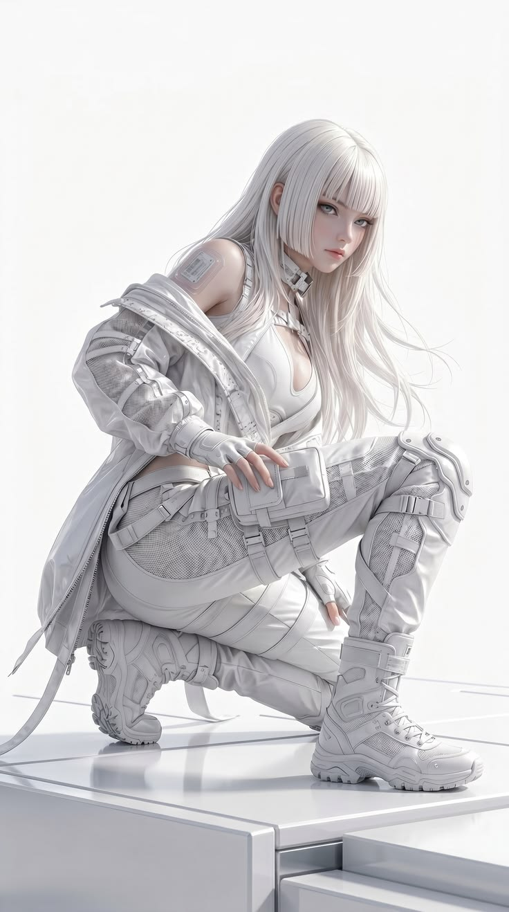
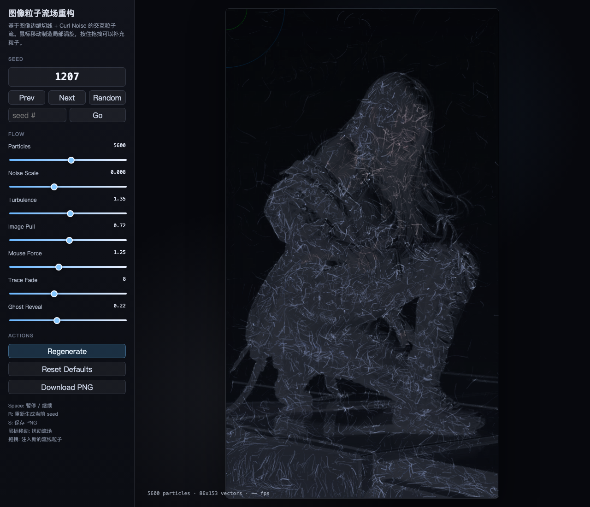

# p5.js 图像粒子流场重构：让图像沿着自己的纹理流动起来



图一里那种“鼠标控制粒子流场重构古典名画”的效果，本质上不是单纯给图片加滤镜，而是把图片拆成一套可以被粒子读取的运动规则。

这篇我们用图二这张白色赛博人物参考图，做一个 p5.js 版本的交互流场。完整示例放在同目录：

[打开说明页：flow-field-explainer.html](flow-field-explainer.html)

[打开可交互示例：flow-field-portrait.html](flow-field-portrait.html)

[观看讲解视频：flow-field-video/flow-field-explainer.mp4](flow-field-video/flow-field-explainer.mp4)

效果预览：



运行方式：

```bash
cd CreativeCodingArticles/2026/07/p5js图像粒子流场重构
python3 -m http.server 8080
```

然后打开：

```text
http://localhost:8080/flow-field-explainer.html
http://localhost:8080/flow-field-portrait.html
```

本地图片素材通过 `loadImage()` 读取，建议用本地服务打开，不直接双击 HTML。

## 图一的经典流场实现原理

这种效果通常由 4 层组成：

- **图像采样层**：读取原图每个像素的颜色、亮度和边缘信息。
- **流场层**：把画面切成一个网格，每个网格保存一个二维方向向量。
- **粒子层**：粒子有位置、速度、加速度和生命周期，每一帧查询当前位置所在的流场方向并移动。
- **拖尾渲染层**：粒子不是画一个点就结束，而是在上一帧位置和当前帧位置之间画线，并用低透明度背景慢慢擦除，形成“笔触”。

如果只用 Perlin Noise 做方向，得到的是一个漂亮但和图像关系不强的流场：

```js
let angle = noise(x * scale, y * scale, time) * TWO_PI * 2;
let force = p5.Vector.fromAngle(angle);
```

要让粒子“像是在沿着图像本身流动”，关键是把图像边缘也加入方向计算。做法是先计算亮度梯度：

```js
let gx = lum[x + 1, y] - lum[x - 1, y];
let gy = lum[x, y + 1] - lum[x, y - 1];
```

梯度方向指向亮度变化最快的方向，而我们希望线条沿轮廓走，所以取它的垂直方向：

```js
let tangentAngle = atan2(gy, gx) + HALF_PI;
```

最终的方向不是二选一，而是混合：

- 图像边缘强的地方，更相信 `tangentAngle`，粒子沿头发、衣褶、脸部轮廓滑动。
- 图像平坦的地方，更相信噪声方向，让画面保持自然流动。
- 鼠标靠近时，再额外加入一个局部旋涡力。

这就是图一效果看起来像“被鼠标搅动的画”的原因：图像提供结构，流场提供运动，鼠标提供扰动。

## 用图二重构时的问题

图二不是高对比油画，而是一张整体偏白的参考图。难点有两个：

1. 背景也是白色，人物衣服也是白色，不能简单用“越暗越重要”来采样。
2. 头发、衣服褶皱、机械细节都比较细，如果粒子只按随机噪声走，很容易变成一团雾。

所以这次示例没有直接把原图贴在 canvas 上，而是先构建一张“重要性地图”：

```js
const edge = sqrt(gx * gx + gy * gy) / 70;
const shadow = max(0, (252 - luminance) / 105);
const detail = pow(shadow * 0.85 + edge * 1.35, 0.72);
```

这里的 `detail` 代表某个像素适不适合放粒子：

- `shadow` 负责找出人物身体、衣服阴影和灰阶区域。
- `edge` 负责找出头发、五官、衣褶、鞋子和机械线条。
- 两者叠加后，粒子会更多出生在人物结构上，而不是平均铺满全画面。

## 示例里的流场设计

示例里每个网格向量大致这样生成：

```js
let tangentAngle = atan2(gy, gx) + HALF_PI;
let noiseAngle = noise(x * fieldScale, y * fieldScale, time) * TWO_PI * turbulence;
let imageBlend = min(1, detail * imagePull);

let vx = cos(noiseAngle) * turbulence * (1 - imageBlend * 0.42);
let vy = sin(noiseAngle) * turbulence * (1 - imageBlend * 0.42);

vx += cos(tangentAngle) * imageBlend * 2.1;
vy += sin(tangentAngle) * imageBlend * 2.1;
```

可以把它理解为：

- `fieldScale` 决定流场纹理的大小。
- `turbulence` 决定噪声扰动强度。
- `imagePull` 决定粒子有多服从图像结构。
- `detail` 是每个位置从图像里读到的权重。

当 `imagePull` 大时，人物轮廓会更清楚；当 `turbulence` 大时，画面会更像被风吹散。

## 粒子为什么不会完全飞散

粒子移动时会同时受到 3 个力：

1. **流场力**：沿当前格子的方向移动。
2. **回家力**：每个粒子记录自己的出生点，如果跑到低细节区域，就被轻微拉回原来的图像结构附近。
3. **鼠标力**：鼠标附近生成切向旋涡，按住时力量更强，拖拽时还会注入新粒子。

回家力很重要。没有它，粒子迟早都会离开人物结构，只剩下一些漂亮但不成像的流线。

## 交互参数

示例左侧面板提供了几个参数：

- `Particles`：粒子数量，越高越细腻，也越吃性能。
- `Noise Scale`：噪声采样尺度，控制流线是大弯还是小弯。
- `Turbulence`：噪声扰动强度。
- `Image Pull`：图像结构约束强度。
- `Mouse Force`：鼠标涡旋强度。
- `Trace Fade`：拖尾消失速度，数值越小拖尾越长。
- `Ghost Reveal`：底层人物结构的淡显程度。

快捷键：

- `Space`：暂停 / 继续
- `R`：重新生成当前 seed
- `S`：保存 PNG

## 继续可以尝试的方向

这版还是 CPU Canvas 的做法，优点是代码直观，适合讲原理。如果要继续升级，可以往几个方向走：

- 用 WebGL / shader 做粒子更新，把粒子数量提高到十万级。
- 把边缘切线换成 Sobel 或 Canny，让图像结构更稳定。
- 给头发、衣服、皮肤分别做不同的采样权重和颜色映射。
- 增加“擦除/吸附”模式，让鼠标既能扰动，也能把粒子重新吸回人物轮廓。
- 输出帧序列后用 ffmpeg 合成短视频。

流场的核心不是“让粒子随机飘”，而是设计一张粒子可以读取的运动地图。图像重构类效果里，最关键的一步就是让这张地图同时理解两件事：哪里应该成像，以及成像处应该往哪个方向流动。
