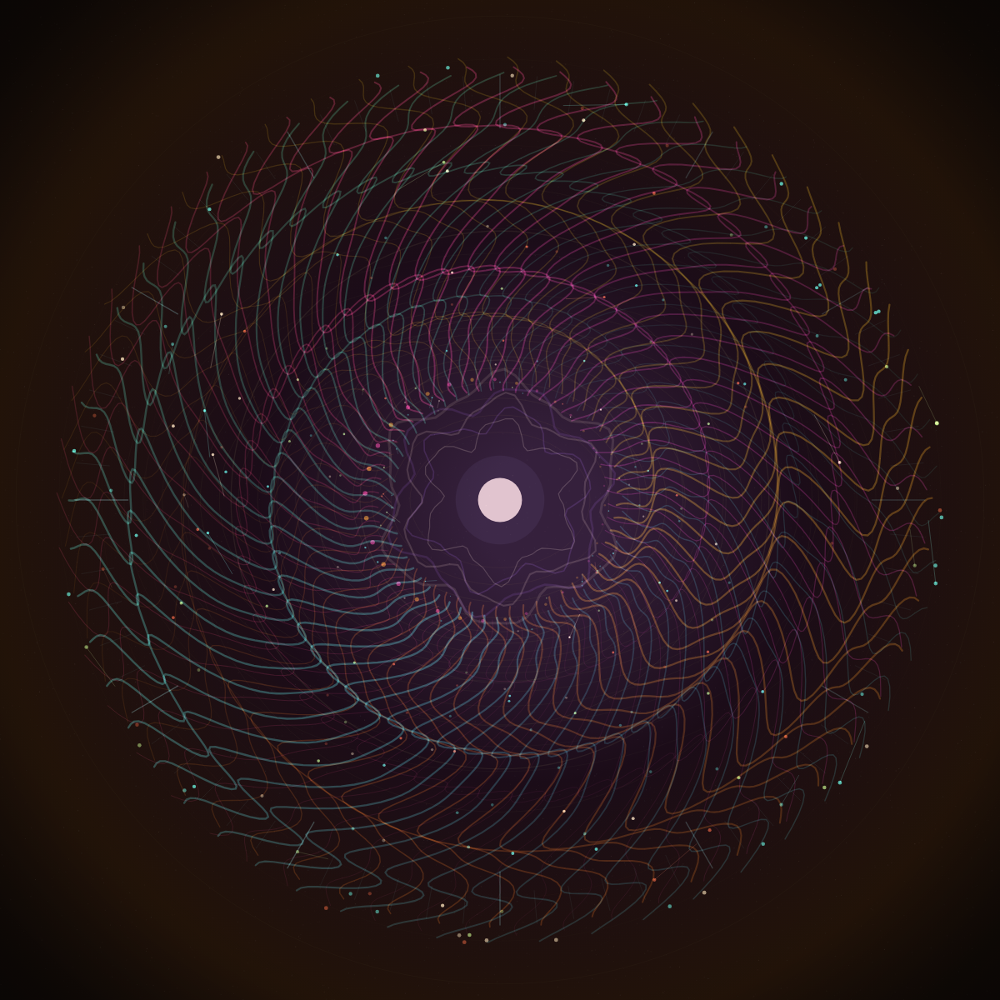

# p5.js 完美循环：星潮织机



这次把《Processing 之完美循环的艺术》里的核心思路改写成一个 p5.js 版本的“星潮织机”：

[打开作品：index.html](index.html)

[15 秒 MP4 视频：star-tide-loom-15s.mp4](star-tide-loom-15s.mp4)

它不是靠动画播完后硬切回第一帧，而是把整幅画面都绑定到一个标准化的循环进度：

```js
const t = timeLoop(240);
```

`t` 的取值永远在 `0..1` 之间。所有会动的东西，旋转、呼吸、拖尾、珠子往返、织线摆动，都只使用 `t`、相位偏移、`sin/cos`、`tri()` 和 `inOutSin()` 推导出来。这样第 241 帧重新回到第 1 帧时，画面状态天然一致。

## 作品想法

文章里的示例从方块、小圆和时间错位竖条开始。这里把它扩展成一个“时间织机”：

- 中心像一枚呼吸的机械星门。
- 三组彩色丝线围绕中心交错，分别用不同相位和方向摆动。
- 发光小珠沿着每条丝线往返，好像潮汐把星尘推入又拉出。
- 背景的径向光晕和粒状纹理保持低调，让循环主体更清楚。

重点不是增加复杂度，而是保证每个视觉层都服从同一个循环时钟。

## 文章公式在项目里的对应关系

文章中最关键的模板是：

```js
function timeLoop(nFramesInLoop, offset = 0) {
  return ((frameCount - 1 + offset) % nFramesInLoop) / nFramesInLoop;
}
```

这个项目保留了同样的设计。`CONFIG.loopFrames = 240`，`frameRate(30)`，所以完整循环是 8 秒。

时间错位用相位偏移做：

```js
const phase = i / strandCount;
const gate = inOutSin(tri(frac01(t + phase)));
```

往返运动用三角波做：

```js
function tri(t) {
  return t < 0.5 ? t * 2 : 2 - t * 2;
}
```

缓入缓出用正弦函数做：

```js
function inOutSin(t) {
  return 0.5 - Math.cos(Math.PI * t) / 2;
}
```

最终的运动不是线性抽动，而是有呼吸感的 `0 -> 1 -> 0`。

## 为什么它是完美循环

项目里没有用 `millis()` 直接驱动画面，也没有在 `draw()` 里调用随机数。每个动态值都满足这条规则：

```js
value(t) === value(t + 1)
```

例如线条摆动：

```js
Math.sin(TWO_PI * (u * 2.5 + t * family.dir + phase))
```

`family.dir` 是整数，所以当 `t` 增加 1 时，正弦函数刚好多转完整圈，结果回到原值。

## 运行方式

这个示例只依赖 p5.js CDN，可以直接用浏览器打开；如果希望更接近发布环境，也可以启动本地服务：

```bash
cd CreativeCodingArticles/2026/07/p5js完美循环星潮织机
python3 -m http.server 8080
```

然后访问：

```text
http://localhost:8080/index.html
```

快捷键：

- `Space`：暂停 / 继续
- `S`：保存 PNG
- `G`：保存一个完整 GIF 循环
- `F`：保存 240 帧 PNG 序列
- `R`：切换 seed 并重新生成纹理

## 视频导出

本目录包含一个 15 秒视频版本：

```text
star-tide-loom-15s.mp4
```

导出参数：

- 分辨率：1080 x 1080
- 帧率：30fps
- 总帧数：450 帧
- 时长：15 秒
- 编码：H.264 / yuv420p

视频不是简单截取 8 秒循环，而是把原始 240 帧循环相位重新采样到 450 帧，让 15 秒视频本身也保持闭合。

## 可以继续改的方向

- 把当前 2D 丝线改成 WebGL 管线，做成真正的空间织机。
- 用 `saveFrames()` 导出序列后，用 ffmpeg 合成更高质量 MP4。
- 给每组丝线绑定不同音轨频段，做音频驱动但仍保持周期性。
- 把中心星门换成文字轮廓，让字形也参与完美循环。
