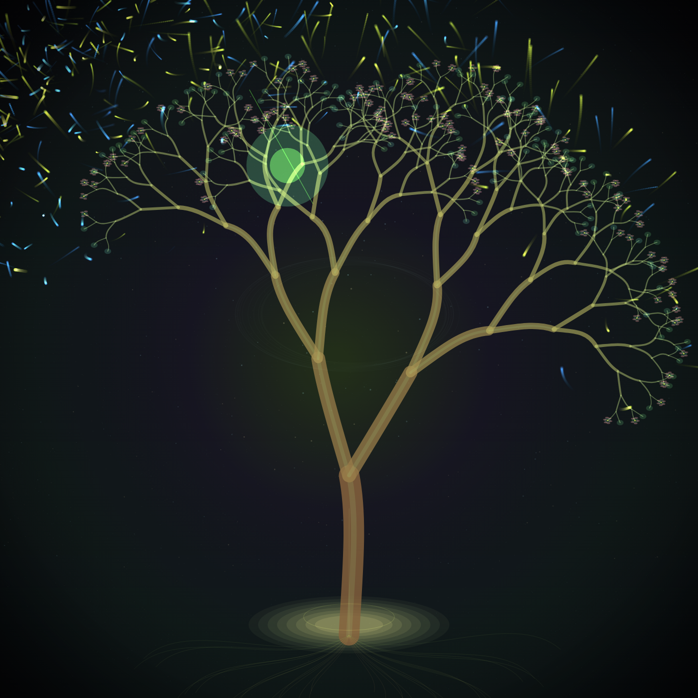

# p5.js 音乐响应生命树：让一棵树听见声音



这次的创意主题是“音乐响应生命树”：树不是预先画好的装饰图，而是一套会被声音重新塑形的递归系统。

[打开作品：index.html](index.html)

默认打开时会运行一段内置 demo signal，保证没有音频权限也能看到动态效果。点击 `Start MIDI` 后，页面会播放一段内置 MIDI 风格合成器循环，并用同一批 MIDI note envelope 驱动画面；点击 `Start Mic` 后，画面会改用麦克风输入做实时 FFT 分析。

## 创意设定

这棵树像一段被光谱喂养的植物神经。MIDI 模式下，画面不再只跟随一个抽象音量值，而是读取正在发声的每个音符：

- 低音 note 的包络推动主干左右摆动，并在根部扩出同频光环。
- 和弦 note 的包络提高分叉深度和分叉数量，同时在树冠中生成透明音环。
- 音量控制枝条粗细，声音越强，树皮越像被墨水压重。
- 高频铃音 note 的包络点亮花朵和发光果实，并在叶端喷出花粉粒子。
- 粒子不是直线飞走，而是被轻微 curl noise 扰动，形成带拖尾的“声波孢子”。

静音时它仍然是一棵完整的生命树；有声音时，它才暴露出自己的节奏结构。

## 技术结构

项目使用 p5.js `1.11.3` 和 `p5.sound`。这里没有使用最新 p5 2.x CDN，原因是这个作品依赖 `p5.sound` 的 `AudioIn` / `FFT`，目前 p5 1.x 组合更稳定，适合可直接运行的浏览器示例。

音频读取分三条路径：

1. `Start MIDI`：用 Web Audio API 播放一段 16 步 MIDI 风格循环。每个音符都会登记进 `activeMidiNotes`，声音合成器和视觉系统读取同一份 `startAt / duration / velocity / role / note`。
2. `Start Mic`：用 `p5.FFT` 分析麦克风输入。
3. `Demo`：使用内置周期信号，不出声，只驱动画面。

MIDI 路径每帧扫描正在发声的音符：

```js
for (const noteEvent of activeMidiNotes) {
  const env = midiEnvelope(noteEvent, now);
  // bass / chord / lead / spark 分别驱动主干、树冠、花朵和花粉
}
```

麦克风路径读取频段：

```js
fft.getEnergy('bass')
fft.getEnergy('mid')
fft.getEnergy('treble')
```

如果音频权限不可用，就使用内置的周期信号模拟 bass / mid / treble，这样首屏不是空画面，也方便录屏和调参。

视觉层分成 4 层：

- `bgLayer`：一次性生成深色渐变、星点和树冠附近的微光。
- `grainLayer`：细颗粒纹理，避免背景变成纯色。
- 主 canvas：每帧绘制递归树、根系和花朵。
- `trailLayer` / `glowLayer`：保留花粉拖尾和叶端辉光。

核心递归从主干开始：

```js
drawBranch(root.x, root.y, trunkAngle, trunkLength, trunkWeight, 0, maxDepth, 1, 0, time);
```

其中：

- `trunkAngle` 受 bass note 包络和低频控制。
- `maxDepth` 受 chord note 包络、mid 和整体音量控制。
- `forks` 受 mid / highMid 影响，可从 2 个分叉增长到 3 或 4 个。
- `recordLeaf()` 收集叶端位置，供 lead / spark note 点亮花朵、果实和花粉。

## 运行方式

这个示例只依赖 CDN，可以直接打开 `index.html`。如果浏览器对音频权限更严格，建议用本地服务：

```bash
cd CreativeCodingArticles/2026/07/p5js音乐响应生命树
python3 -m http.server 8080
```

然后访问：

```text
http://localhost:8080/index.html
```

快捷键：

- `Space`：暂停 / 继续
- `S`：保存 PNG
- `G`：保存 5 秒 GIF
- `F`：保存 5 秒帧序列
- `R`：切换 seed 并重新生成背景纹理

## 可以继续改的方向

- 把内置 MIDI 序列换成真实 `.mid` 文件解析，让作品跟随固定曲目生成可复现视频。
- 给每个频段分配不同植物器官，例如低频控制根系，中频控制树冠，高频控制花粉。
- 把递归树改成 WebGL 管线，让枝条拥有更明显的空间厚度。
- 记录 FFT 历史，把过去几秒的声音画成树干年轮。
