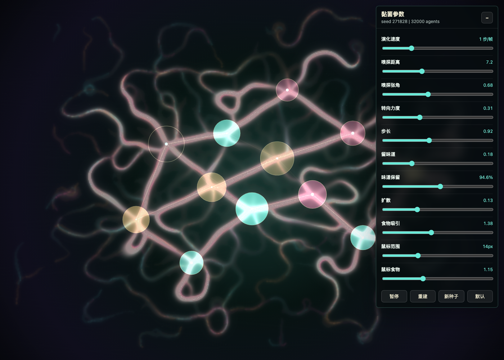

# p5.js 黏菌模拟：东京脉络培养皿



这次把 Jeff Jones 的 Physarum 黏菌模拟改写成一个 p5.js 版本的“东京脉络培养皿”：

[打开作品：index.html](index.html)

如果想看更接近参考图那种高密度荧光菌丝场景，可以打开第二个版本：

[打开高密度版本：dense-mycelium.html](dense-mycelium.html)

画面不是预先画好的线路图。它只给一批虚拟黏菌粒子几个营养点和淡淡的路线倾向，然后让它们在化学梯度场里自己移动、沉积、扩散、衰减。跑起来以后，强路径会被反复强化，弱路径会慢慢消失，最后长出像地铁网络又像菌丝血管的结构。

## 创意设定

这个作品想把“培养皿里的微观智能”和“夜间城市交通图”叠在一起：

- 暗绿色和深紫色背景像培养基，也像夜晚的城市底图。
- 12 个营养点模拟主要枢纽，不直接写站名，只用发光节点暗示。
- 线路骨架只是一层很弱的偏置，真正的路径由粒子反复嗅探和沉积生成。
- 三种粒子族群分别留下青色、琥珀色和玫红色信息素，让主干、支线和竞争路径有不同气质。
- 鼠标按住拖动时会临时撒下一小块“燕麦片”，黏菌会被吸引并重新编织局部网络。

重点不是复刻东京地图，而是保留 Physarum 算法里最迷人的部分：没有中央规划，却会出现看起来很像规划过的连接效率。

## 算法结构

模拟层用低分辨率化学场和 typed arrays 运行，视觉层再放大合成到浏览器画布：

```js
const f = sampleChemical(x + Math.cos(a) * sensorDist, y + Math.sin(a) * sensorDist);
const l = sampleChemical(x + Math.cos(a - sensorAngle) * sensorDist, y + Math.sin(a - sensorAngle) * sensorDist);
const r = sampleChemical(x + Math.cos(a + sensorAngle) * sensorDist, y + Math.sin(a + sensorAngle) * sensorDist);
```

每个 agent 每一步做四件事：

1. 在前方、左前方、右前方三个方向采样化学浓度。
2. 转向浓度更高的一侧。
3. 向前移动，并在当前位置沉积信息素。
4. 整张信息素场做扩散和衰减。

信息素不是单通道，而是三通道：

```js
trails = [
  new Float32Array(fieldCount),
  new Float32Array(fieldCount),
  new Float32Array(fieldCount)
];
```

这样不同族群的路径会混色，不会只得到一张灰度热力图。

## 为什么要先预热

真实 Physarum 从空白培养皿长出网络需要时间。浏览器作品如果第一帧只有几个点，会显得像还没加载完。所以 `setup()` 里先跑 160 步模拟：

```js
for (let i = 0; i < CONFIG.warmupSteps; i++) {
  simulateStep(false);
}
```

打开时已经能看到初始网络，随后继续演化。

## p5.js 版本说明

项目使用 p5.js `1.11.3` 固定 CDN。这里没有使用 p5 2.x，原因是这个作品依赖稳定的 1.x 全局模式、`saveCanvas()`、`saveGif()` 和当前仓库 p5 技能默认生产配置；固定版本也能保证截图和导出更可复现。

## 运行方式

这个示例只依赖 p5.js CDN，可以直接用浏览器打开；如果希望更接近发布环境，也可以启动本地服务：

```bash
cd CreativeCodingArticles/2026/07/p5js黏菌模拟
python3 -m http.server 8080
```

然后访问：

```text
http://localhost:8080/index.html
```

快捷键：

- `Space`：暂停 / 继续
- `S`：保存 PNG
- `G`：保存 8 秒 GIF
- `F`：保存 6 秒帧序列
- `R`：切换 seed 并重新生成网络

右上角参数面板可以直接调算法：

- `演化速度`：每帧跑几步模拟，越高网络长得越快。
- `嗅探距离` / `嗅探张角`：粒子三只“鼻子”看多远、分多开。
- `转向力度` / `步长`：粒子转弯和移动的幅度。
- `留味道`：走过的位置留下多少信息素。
- `味道保留`：信息素消失得快不快。
- `扩散`：信息素往周围晕开的程度。
- `食物吸引`：营养点对粒子的吸引权重。
- `鼠标范围` / `鼠标食物`：按住鼠标投喂时影响多大、多强。

高密度版本现在强调“从 0 到 N”的生长过程，而不是一开始展示完整网络：

- 初始画面只有暗背景、营养点和少量刚孵化的寻味代理。
- 预生成的主脉、细枝、孢子云不再直接绘制出来。
- 隐藏的营养场只负责被代理“闻到”，不会被当成现成图层显示。
- 寻味代理会逐步激活，读取前方、左前、右前的信息素和营养浓度，朝更香的方向转弯。
- 所有可见脉络都来自代理走过后留下的信息素沉积、扩散和衰减。
- 鼠标按住时会注入新的营养，附近代理会逐渐被吸过去，而不是瞬间画出一簇现成枝条。

## 可以继续改的方向

- 把营养点换成真实东京地铁站经纬度，比较算法生成网络和真实线路的差异。
- 为每条真实线路分配不同信息素族群，观察竞争和合并路径。
- 加一个“障碍物”图层，让黏菌绕开河流、海湾或城市禁区。
- 导出长时间 MP4，展示网络从探索到收敛的全过程。
